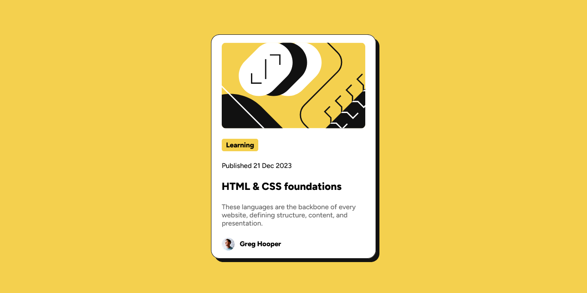

# Frontend Mentor - Blog preview card solution

This is a solution to the [Blog preview card challenge on Frontend Mentor](https://www.frontendmentor.io/challenges/blog-preview-card-ckPaj01IcS). Frontend Mentor challenges help you improve your coding skills by building realistic projects. 

## Table of contents

- [Overview](#overview)
  - [The challenge](#the-challenge)
  - [Screenshot](#screenshot)
  - [Links](#links)
- [My process](#my-process)
  - [Built with](#built-with)
  - [What I learned](#what-i-learned)
  - [Continued development](#continued-development)
  - [Useful resources](#useful-resources)
- [Author](#author)
- [Acknowledgments](#acknowledgments)

## Overview

### The challenge

Users should be able to:

- See hover and focus states for all interactive elements on the page

### Screenshot



### Links

- Solution URL: [frontend mentor](https://www.frontendmentor.io/solutions/qr-code-component--pELIpnmbT)
- Live Site URL: [GitHub pages](https://hypertags.github.io/blog-preview-card-main/)

## My process

### Built with

- Semantic HTML5 markup
- CSS custom properties
- Flexbox
- CSS Grid
- Mobile-first workflow

### What I learned

I learnt how to position a child element in a parent element using grid.

The syntax used is as below:

```css
.parent-element {
  display: grid;
  place-items: center;
}
```

I also discovered that the place-items gives align-items and justify-content a default value of center.

### Continued development

Even though I can find my way around flexbox and grid, I seek to learning more and perfecting myself in them. I also seek to perfect myself in using media queries and box shadow.

### Useful resources

- [Colors and Shadows - Devslopes](https://youtu.be/EMJYCGaaIUo?si=XKVh2jakuS_qlHdA) - This helped me understand the possible values that can be given to the box shadow style and what they mean. It was really helpful.

## Author

- GitHub - [@HyperTags](https://github.com/HyperTags)
- Frontend Mentor - [@HyperTags](https://www.frontendmentor.io/profile/HyperTags)
- LinkedIn - [David Addo](https://linkedIn.com/in/david-addo-6ba707350)


## Acknowledgments

I would like to say a very BIG thank you to Frontend Mentor for providing us an opportunity to learn and build real projects. I would also like to thank myself for being able to complete this project, glory be to God Almighty for His help. I want appreciate Fabian at Coding2Go for his inspiration and consistent update on frontend development. Thank you to you all!
